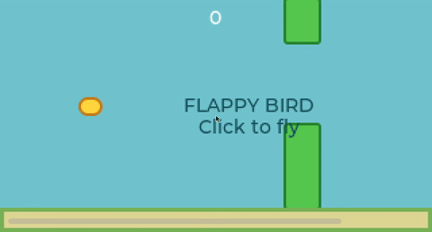

# Flappy Bird for ESP32-S3 + Zig + LVGL



A touch-controlled Flappy Bird game written in Zig for the Waveshare
ESP32-S3-Touch-LCD-1.47. Hold the device in landscape orientation and tap the
screen to make the bird flap through the pipes.

## Current state

The firmware rotates the 172×320 LCD by 90 degrees into a 320×172 game area,
polls the capacitive touch controller over I²C, and implements flap physics,
randomized pipes, collision detection, scoring, and tap-to-restart gameplay.

It builds with the pinned toolchain, has been flashed to the real board, and
boots stably with its 8 MB PSRAM detected. Confirm the landscape layout and
touch gameplay on the physical LCD after flashing, since serial monitoring
cannot observe either behavior.

The application entry point, UI construction, rendering, and state machine live
in [`main/main.zig`](main/main.zig). [`main/platform.c`](main/platform.c) is a
hardware and C-ABI adapter: it initializes the display and touch buses, flushes
LVGL draw buffers, reads the touch controller, and wraps the few configuration-
sensitive LVGL inline functions used by Zig.

[`build.zig`](build.zig) owns compilation of the Zig application object.
The ESP-IDF CMake build invokes it before linking that object with the platform
adapter and the required ESP-IDF components.

The build uses:

- ESP-IDF 5.5.2;
- the experimental Xtensa Zig 0.17.0 toolchain from
  [`zig-espressif-bootstrap`](https://github.com/kassane/zig-espressif-bootstrap);
  and
- LVGL 8.4.0 from the ESP Component Registry.

## Hardware

The target is the **Waveshare ESP32-S3-Touch-LCD-1.47**, standard version
without pre-soldered pin headers (**SKU 31202**):

- ESP32-S3R8, dual-core Xtensa LX7 at up to 240 MHz;
- 16 MB flash and 8 MB octal PSRAM;
- 1.47-inch 172×320 IPS display;
- JD9853 display controller using 4-wire SPI;
- AXS5106L capacitive touch controller using I²C; and
- native USB Serial/JTAG over USB-C.

Official references:

- [Waveshare product page](https://www.waveshare.com/esp32-s3-touch-lcd-1.47.htm)
- [Waveshare documentation](https://docs.waveshare.com/ESP32-S3-Touch-LCD-1.47)

This is **not** the similarly named non-touch `ESP32-S3-LCD-1.47`. That board
uses an ST7789 display controller and a different pinout.

### Display and touch connections

| Function | GPIO |
| --- | ---: |
| LCD SPI clock | 38 |
| LCD SPI MOSI | 39 |
| LCD reset | 40 |
| LCD chip select | 21 |
| LCD data/command | 45 |
| LCD backlight | 46 |
| Touch I²C SCL | 41 |
| Touch I²C SDA | 42 |
| Touch reset | 47 |
| Touch interrupt | 48 |

The touch interrupt is wired but the current firmware polls the controller.
The GPIO assignments and JD9853 initialization sequence follow the official
Waveshare schematic and demo.

## Build and run

### Prerequisites

Install [Nix](https://nixos.org/download/) with flakes enabled. The flake
supports x86_64 and ARM64 Linux plus ARM64 macOS, and supplies ESP-IDF, the
ESP32-S3 GCC toolchain, esptool, OpenOCD, and the Xtensa Zig compiler.

Enter the development environment from the repository root:

```sh
nix develop
```

The first build downloads the pinned LVGL managed component. Build the
firmware with:

```sh
idf.py build
```

Connect the board over USB-C, then flash it and open the serial monitor:

```sh
idf.py -p /dev/ttyACM0 flash monitor
```

Replace `/dev/ttyACM0` with the port assigned to the board. Flashing resets
the board and starts the firmware automatically. Exit the monitor with
`Ctrl-]`.

After startup, the display should show the Flappy Bird start screen in
landscape orientation. Tap anywhere to start and tap again whenever the bird
needs to flap. After a collision, tap to start a new game.

### Native simulator

The same Zig game loop can run in a native 320×172 LVGL/SDL3 window. Mouse
clicks and the space bar act as simulated screen taps. From the repository
root, enter the Nix environment and build and run it with:

```sh
zig build -Dsimulator=true
zig build run -Dsimulator=true
```

The simulator validates game behavior and the LVGL layout, but not the ESP32,
physical display, or touch-controller integration. Its SDL3 lifecycle, rendering,
input, and timing are implemented in [`simulator/main.zig`](simulator/main.zig);
the small C binding only adapts configuration-dependent LVGL bitfield structs
and inline helpers.

To remove generated configuration and build output before rebuilding:

```sh
idf.py fullclean
idf.py build
```

## USB permissions on Linux

The Nix shell cannot grant device permissions. On non-NixOS Linux, add your
user to the serial-device group (usually `dialout`) and log in again:

```sh
sudo usermod -aG dialout "$USER"
```

If USB-JTAG access fails, install the ESP-IDF udev rules for your system.
